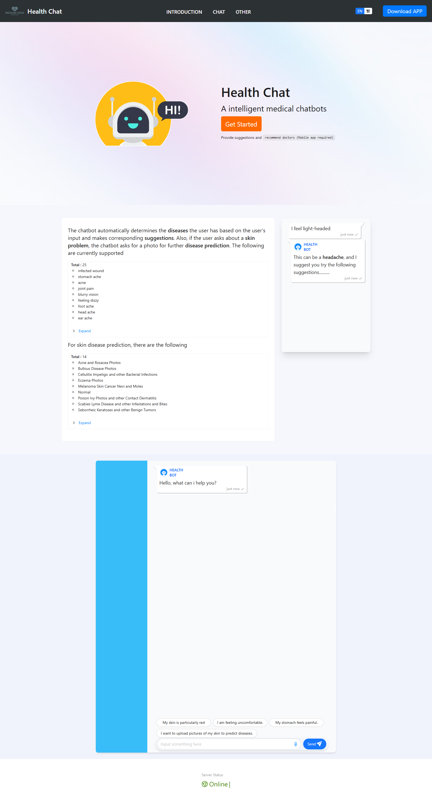

# Querying skin diseases through AI chatbot.
# FYP FRONTEND PROJECT

https://www.moovoo.art/

https://ambitious-coast-083d4e100.2.azurestaticapps.net

## Introduction

The original intention of this project is to identify skin diseases by using AI chatbot and analyzing user-provided skin images, while also offering corresponding suggestions. Additionally, the mobile application will recommend the nearest doctors to the users

## Screen

# All FYP SOURCE CODE
BACKEND-SERVER : https://github.com/kjjkjjzyayufqza/6001CEM_FYP_CHATBOT_PYTHON

WEB : https://github.com/kjjkjjzyayufqza/6001CEM_FYP_WEB

MOBILE : https://github.com/kjjkjjzyayufqza/6001CEM_FYP_MOBILE

TRAIN-CODE : https://github.com/kjjkjjzyayufqza/6001CEM_FYP_TRAIN_CODE
